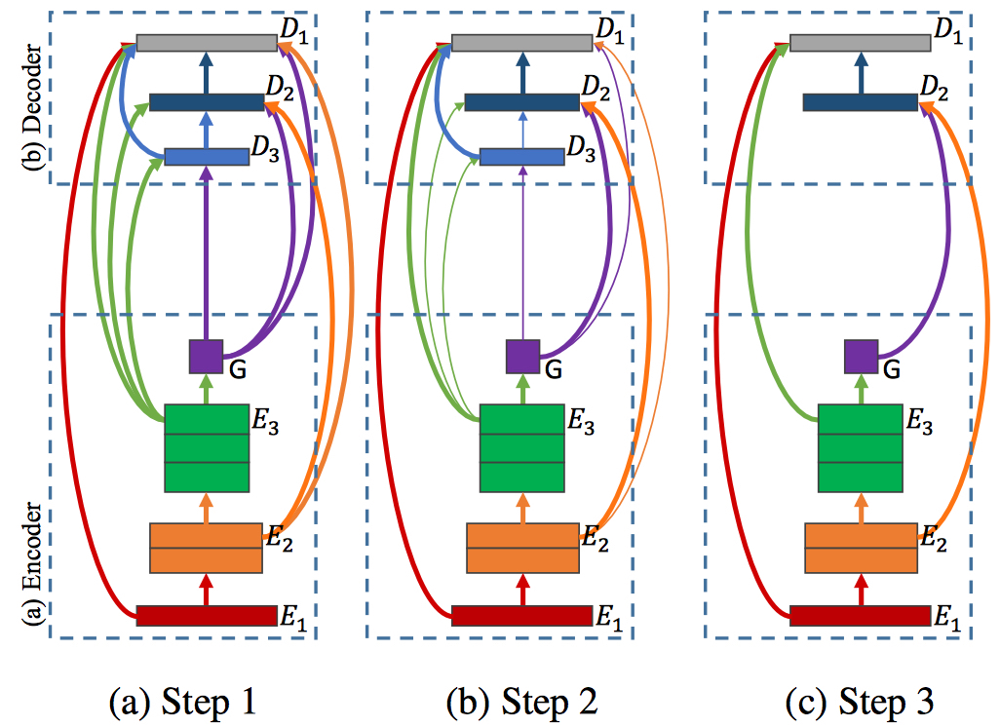
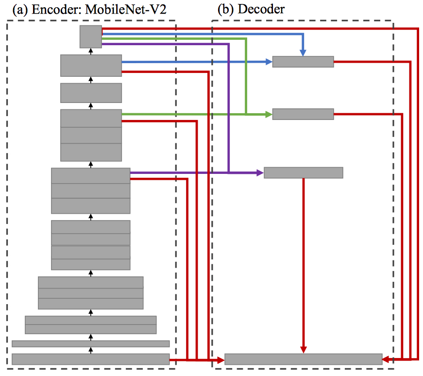

# SparseMask: Differentiable Connectivity Learning for Dense Image Prediction
[[Project]](http://wuhuikai.me/SparseMask/)    [[Paper]](http://wuhuikai.me/SparseMask/sparse_mask.pdf)    [[arXiv]](https://arxiv.org/abs/1904.07642)    [[Home]](http://wuhuikai.me)    [[AWESOME NAS]](awesome_nas.md)

Official implementation of **SparseMask: Differentiable Connectivity Learning for Dense Image Prediction**.
Automatically design the connectivity structure for dense image prediction tasks, achieving **better** fusion of multi-scale feature maps.
```
@inproceedings{wu2019sparsemask,
  title     = {SparseMask: Differentiable Connectivity Learning for Dense Image Prediction},
  author    = {Wu, Huikai and Zhang, Junge and Huang, Kaiqi},
  booktitle = {arXiv preprint arXiv:1904.07642},
  year = {2019}
}
```
Contact: Hui-Kai Wu (huikaiwu@icloud.com)

## Overview
### Method

### Automatically Designed Architecture


## Requirements
```
python==3.5
pytorch==1.0
cuda==9.0
scipy
scikit-image
tqdm
tensorboardX
tensorflow
```

## Prepare Dataset: PASCAL-VOC 2012
1. Download and unzip [PASCAL VOC 2012](http://host.robots.ox.ac.uk/pascal/VOC/voc2012/VOCtrainval_11-May-2012.tar) and [SBD](http://www.eecs.berkeley.edu/Research/Projects/CS/vision/grouping/semantic_contours/benchmark.tgz).
    ```sh
    ROOT
    ├── benchmark_RELEASE
    └── VOCdevkit
    ```
2. Convert *.**mat** to *.**png** for SBD.
    ```sh
    python VOC12/convert_mat_to_png.py --sbd_path [ROOT]/benchmark_RELEASE
    ```
3. Convert labels for PASCAL VOC 2012.
    ```sh
    python VOC12/convert_labels.py \
                [ROOT]/VOCdevkit/VOC2012/SegmentationClass \
                [ROOT]/VOCdevkit/VOC2012/ImageSets/Segmentation/trainval.txt \
                [ROOT]/VOCdevkit/VOC2012/SegmentationClass_1D
    ```
4. Combine **PASCAL VOC 2012** and **SBD**.
    ```sh
    cd [ROOT]
    mv VOCdevkit/VOC2012/SegmentationClass_1D/*.png benchmark_RELEASE/dataset/cls_png/
    mv VOCdevkit/VOC2012/JPEGImages/*.jpg benchmark_RELEASE/dataset/img/
    ```
5. Soft link.
    ```sh
     ln -s [ROOT]/benchmark_RELEASE/dataset/cls_png data/gt
     ln -s [ROOT]/benchmark_RELEASE/dataset/img data/img
    ```

## Step by Step
### Search
```
 python train_sparse_mask.py --search
```

### Prune
```
python prune.py --checkpoint search_checkpoint/checkpoint_33100.pth.tar
```

### Train
```
python train_sparse_mask.py --mask_path search_checkpoint/mask_thres_0.001.npy
python train_sparse_mask.py --mask_path search_checkpoint/mask_thres_0.001.npy --training_list VOC12/data/train.txt --lr 0.0005 --ft_model [MODEL_PATH]
```

### Eval
```
python eval_sparse_mask.py --pretrained_model train_checkpoint/checkpoint_4600.pth.tar --mask_path search_checkpoint/mask_thres_0.001.npy
```

## Acknowlegement
Part of the work was conducted while I was an intern in [Preferred Networks](https://www.preferred-networks.jp/en/).
